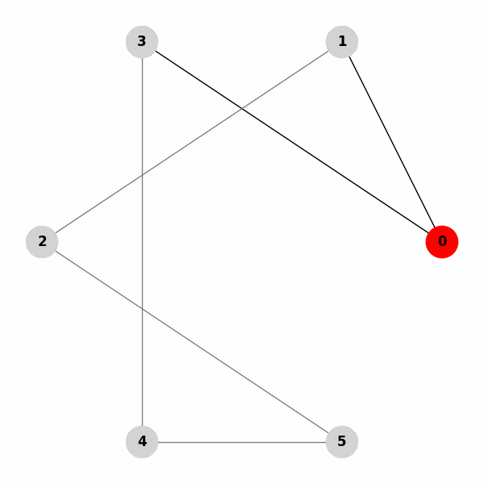

# Polimi Passion In Action GPU101 course Project

  

[Polimi website](https://www.polimi.it/formazione/passion-in-action/dettaglio/gpu-101-2)

### Assignment:
Given the sequential C++ version of the well-known BFS algorithm, develop a parallelized solution using CUDA.

---
# BFS algorithm
### What is BFS and How It Works

Breadth-First Search (BFS) is a graph traversal algorithm that explores all vertices of a graph level by level, starting from a given source node. It uses a queue data structure to keep track of the nodes to be explored and ensures that nodes closer to the source are visited before those farther away.

#### Steps of the BFS Algorithm:
1. Start at the source node and mark it as visited.
2. Add the source node to a queue.
3. While the queue is not empty:
   - Dequeue the front node from the queue.
   - Explore all its adjacent unvisited nodes:
     - Mark them as visited.
     - Enqueue them for further exploration.

---

### Example: BFS on a Graph Represented by an Adjacency Matrix

Consider the following graph, represented as an adjacency matrix:

|     | 0 | 1 | 2 | 3 | 4 | 5 |
|-----|---|---|---|---|---|---|
| **0** | 0 | 1 | 0 | 1 | 0 | 0 |
| **1** | 1 | 0 | 1 | 0 | 0 | 0 |
| **2** | 0 | 1 | 0 | 0 | 0 | 1 |
| **3** | 1 | 0 | 0 | 0 | 1 | 0 |
| **4** | 0 | 0 | 0 | 1 | 0 | 1 |
| **5** | 0 | 0 | 1 | 0 | 1 | 0 |

---

### Running BFS Starting from Node 0

Steps of the algorithm:

| Iteration | Queue      | Visited Nodes       |
|-----------|------------|---------------------|
| 1         | [0]        | {0}                |
| 2         | [1, 3]     | {0, 1, 3}          |
| 3         | [3, 2]     | {0, 1, 2, 3}       |
| 4         | [2, 4]     | {0, 1, 2, 3, 4}    |
| 5         | [4, 5]     | {0, 1, 2, 3, 4, 5} |
| 6         | []         | {0, 1, 2, 3, 4, 5} |

The BFS traversal order is: **0 → 1 → 3 → 2 → 4 → 5**

---

### BFS Animation

Below is the BFS animation, illustrating the algorithm's step-by-step traversal:

